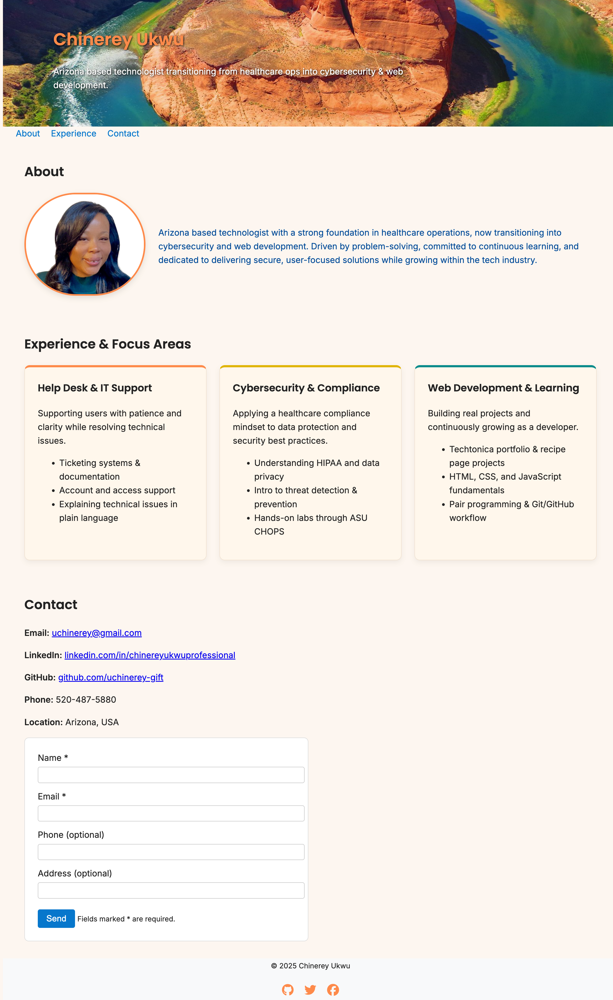

# 🌵 Chinerey “Chi Chi” Ukwu – Portfolio Website

This is my personal portfolio website created for the Techtonica Software Engineering Program.  
It highlights my transition from healthcare operations into cybersecurity, IT support, and web development.  
The purpose of this project is to practice semantic HTML, CSS, accessibility, responsive layouts, and real-world portfolio structure.

---

## 📸 Screenshot



---

## ⭐ Deployed Website

You can view the live version of my portfolio here:

**https://uchinerey-gift.github.io/portfolio-website/**

---

## 📘 What This Project Is

This project is a simple and accessible portfolio webpage that includes:

- A hero section with an Arizona-inspired background  
- An About section with a circular headshot  
- A three-card Experience section using CSS Grid  
- A Contact section with a form and ARIA attributes  
- Footer with animated social icons  
- Smooth scrolling, clean layout, and responsive design  

---

## 🎨 Features

- **Semantic HTML5 structure**  
- **Responsive design** using Flexbox + CSS Grid  
- **Hover animations** on experience cards  
- **Google Fonts (Inter + Poppins)** for clean typography  
- **Accessible navigation** with a Skip Link  
- **Color palette inspired by Arizona landscapes**  
- **Open Graph + Twitter meta tags** for strong SEO  
- **Font Awesome icons** for social media  
- **Contact form with required + optional fields**  
- **Mobile-first media queries**  

---

## ♿ Accessibility (a11y)

This project includes accessibility best practices such as:

- `lang="en"` declared in the `<html>` tag  
- **Skip to main content** link for keyboard users  
- `aria-label` on navigation and social icons  
- `aria-labelledby` on major sections  
- `aria-required="true"` for required form fields  
- `aria-describedby` for form helper text  
- High-contrast text in the hero section  
- Alt text on the profile photo  
- Hover & focus states for interactive elements  
- Tested using **Lighthouse** and **axe DevTools**  

Accessibility was a major focus during development to ensure a better experience for screen readers and keyboard-only users.
 
---

## 🌱 Future Improvements

As I continue learning web development, here are features I plan to add:

- Smooth fade-in animations for hero text and experience cards  
- Add JavaScript form validation with aria-live announcements  
- Add a “Back to Top” button for mobile usability  
- Build a dedicated Projects page with more portfolio pieces  
- Add a dark/light mode toggle  
- Improve mobile navigation with a responsive hamburger menu  
- Continue strengthening accessibility based on Lighthouse and axe audits  
 
---

## 📚 References

These resources supported the development of this portfolio:
- MDN Web Docs: https://developer.mozilla.org/
- W3C Web Accessibility Initiative: https://www.w3.org/WAI/
- Techtonica Curriculum
- Font Awesome Icons: https://fontawesome.com/
- Google Fonts: https://fonts.google.com/
- GitHub Pages Documentation: https://pages.github.com/

## 🛠️ Installation

To run this project locally:

```bash
# Clone the repository
git clone https://github.com/uchinerey-gift/portfolio-website.git

# Move into the project directory
cd portfolio-website

# Open the project
open index.html      # macOS
start index.html     # Windows

---

## 🔗 Live Website

**https://uchinerey-gift.github.io/portfolio-website/**

<!-- PR test update -->

